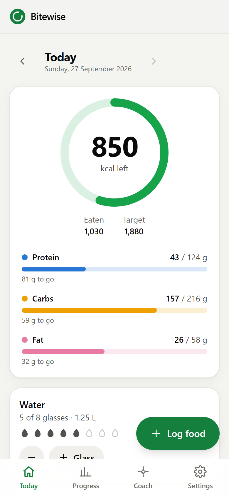
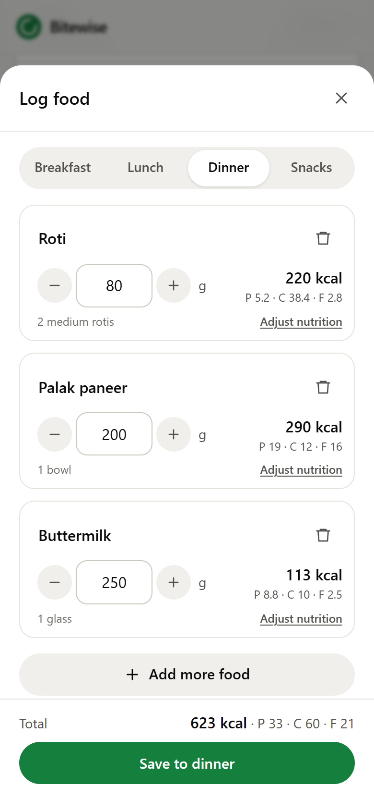
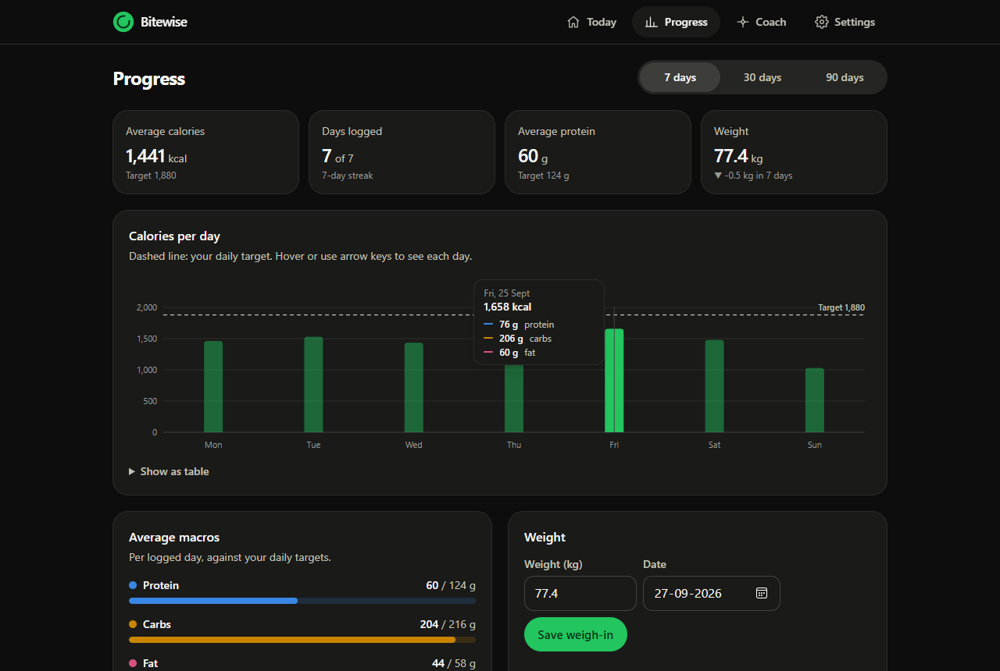

# Bitewise: a diet tracker with local AI

Log what you eat by **typing it in plain words** ("2 rotis, a bowl of dal and some curd") or **snapping a photo**, and a local AI model works out the calories, protein, carbs and fat. An **AI coach** can see your log and targets and suggests what to eat next.

Everything runs on your own computer through [Ollama](https://ollama.com). It needs no API key, costs nothing, and your food log never leaves your machine.

<p align="center">
  
  &nbsp;
  
</p>
<p align="center">
  
</p>

With the default `qwen3.5:9b` model on a laptop GPU, a typed meal takes about 3–10 seconds, a photo about 5 seconds, and the coach starts answering within 2–3 seconds.

## Features

- **Personal targets.** Calories come from the Mifflin–St Jeor formula, your activity level and your goal (lose, maintain or gain). Protein, carbs and fat are split from that. You can also set your own numbers.
- **AI food logging** from a text description or a meal photo. Results appear on a "plate" you can fix before saving: change grams with − / +, rename, remove, or adjust the nutrition.
- **Manual entry** and a **recent foods** list for things you eat often.
- **Today view:** a calorie ring, macro bars, water glasses and meals grouped by breakfast, lunch, dinner and snacks. Tap an entry to edit or delete it.
- **Progress:** calories per day against your target (7, 30 or 90 days), average macros, a weight log with a trend line, and a logging streak. Logging a new weight updates your targets.
- **AI coach chat** that streams its answers and knows your targets, today's log, the last 7 days and your weight trend.
- **Works on your phone** over your home Wi-Fi, so you can photograph meals with the phone camera.
- Light and dark mode, keyboard accessible, and colorblind-safe chart colors.

## Requirements

- [Node.js](https://nodejs.org) 20.9 or newer (you have 24)
- [Ollama](https://ollama.com) running, with at least one model. The default is `qwen3.5:9b`, which reads both text and photos:

  ```bash
  ollama pull qwen3.5:9b
  ```

  Any other chat model works for typed meals and the coach. For photos you need a vision model such as `qwen3.5:9b` or `qwen2.5vl:7b`.

## Run it

```bash
npm install
npm run dev
```

Open http://localhost:3000, fill in your profile, and start logging.

For everyday use, a production build is faster:

```bash
npm run build
npm start
```

### On your phone

1. Start Ollama and the app on your computer (either command above).
2. Connect your phone to the **same Wi-Fi**.
3. Open **Settings → Use it on your phone** in the app and type the address shown (like `http://192.168.1.16:3000`) into your phone's browser. Use "Add to Home screen" to get an app icon.
4. If it doesn't load, allow **Node.js** through Windows Firewall (Windows usually asks the first time).

The phone is only a screen: the AI runs on your computer's graphics card and your log is saved on the computer, so the phone and the computer always show the same data. The computer has to be on and awake.

- **The address can change** when your router hands out a new one. Settings always shows the current one. If it changes while `npm run dev` is running, restart it.
- **There's no login.** Anyone on the same Wi-Fi can open the app while it's running. That's fine at home, but stop it on shared networks such as college or café Wi-Fi.

## How the AI part works

- `src/lib/ollama.ts` talks to Ollama's HTTP API (`/api/chat` with streaming).
- `src/lib/prompts.ts` holds the prompts and a **JSON schema**. Ollama forces the model's answer to match that schema, so the app always gets clean data.
- The model returns each food's **weight in grams** and its **nutrition per 100 g**, and the app does the multiplication. Small local models recall food-table values well but get portion arithmetic wrong (one test answered "200 g chicken = 165 kcal", which is the per-100 g value). Splitting the job made the estimates much more accurate.
- Results are sanity-checked (`sanitizePer100g` in `src/lib/nutrition.ts`): macros can't weigh more than 100 g per 100 g, and nothing has more calories than pure fat.
- Answers stream back as they're generated, so the UI shows foods as the model names them.
- The model starts loading as soon as you open "Log food", so it's usually ready by the time you've typed.

**Speed tips:** the first request after starting Ollama loads the model, which can take a minute. After that a typed meal takes a few seconds. If the graphics card is busy (a game running, for example), everything slows down. Pick a smaller model such as `qwen3:4b-instruct` under **Settings → AI models** for faster typed meals.

## Your data

Everything is stored in the `data/` folder: `diet.json` for your log and `photos/` for meal thumbnails. The folder is ignored by git. **Settings → Your data** lets you download a backup, restore from one, or delete everything.

## Configuration (optional)

Copy `.env.example` to `.env.local` to change the Ollama address, force specific models, keep models in memory longer, or store data somewhere else.

## Project structure

```
src/
  app/
    page.tsx, progress/, coach/, settings/   pages (thin wrappers around the views)
    api/                                     backend route handlers
      state/  profile/  entries/  weights/  water/  settings/  backup/  photos/
      ai/analyze   text or photo → food items (streams progress)
      ai/coach     chat with the coach (streams the reply)
      ai/status    is Ollama running, which models are installed
      ai/warmup    load the model in the background
  components/
    today/  food/  progress/  coach/  settings/   the screens
    charts.tsx, meters.tsx                       calorie ring, macro bars, charts
    StoreProvider.tsx                            app state + calls to the API
  lib/
    nutrition.ts   BMR/TDEE/targets and nutrition math
    ollama.ts      Ollama client
    prompts.ts     AI prompts and the JSON schema
    db.ts          JSON file storage
```

Built with Next.js 16 (App Router), React 19, TypeScript and Tailwind CSS 4. It has no other runtime dependencies.

## Ideas for what's next

- Barcode scanning with the free Open Food Facts API
- A local food database (for example the Indian Food Composition Tables) so common foods get exact values instead of AI estimates
- Saved "meals" (your usual breakfast in one tap)
- Weekly AI summary and meal plans
- Switch storage to SQLite and add accounts if you want to deploy it for other people

AI estimates can be off, so treat the numbers as a guide, not medical advice.
